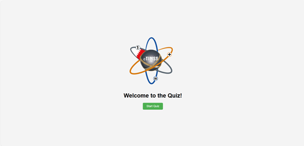
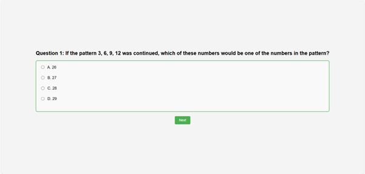
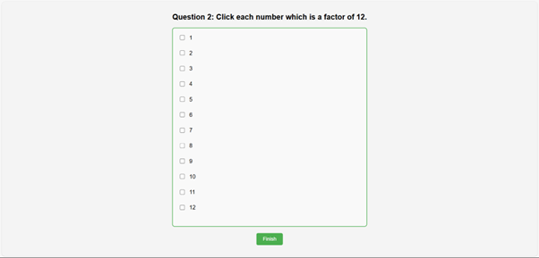
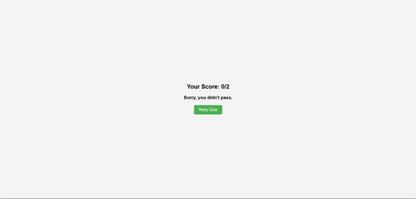

#eTIMSS Quiz

##  Screenshots
Here are the four pages of the quiz:

### View Live Version

### Run Locally

This is a simple quiz game that tests the user's knowledge with multiple-choice questions. The game consists of four pages:

1. **Page 1**: A welcome screen with a "Start" button to begin the quiz.
2. **Page 2**: The first multiple-choice question with four options.
3. **Page 3**: A question where the user selects multiple correct answers (factors of 12).
4. **Page 4**: The results page that shows the score based on the user's answers.

The goal of the game is to provide a simple, interactive way for users to answer questions and see their score at the end.

## User Stories

- **User Story 1: Start the Game**
    - As a user, I want to start the quiz by clicking a "Start" button.
- **User Story 2: Answer Multiple-Choice Question**
    - As a user, I want to answer a multiple-choice question.
    - As a user, I can select one option only from four available choices.
- **User Story 3: Answer Multiple Answers Question**
    - As a user, I want to select multiple correct answers for a question about factors of 12.
- **User Story 4: View Result**
    - As a user, I want to see my score after answering all the questions.

## Pseudo Code

### 1. DEFINE CONSTANTS AND VARIABLES
DEFINE PAGES for each page of the quiz (PAGE1, PAGE2, PAGE3, PAGE4)
DEFINE ANSWERS for correct answers to question1 and question2
DECLARE currentPage and set it to PAGE1
DECLARE score and set it to 0

### 2. CACHE DOM ELEMENTS
GET the Start button element
GET all page elements with class "page"

### 3. ADD EVENT LISTENERS
WHEN the window loads, CALL the initialize function
WHEN Start button is clicked, CHANGE to PAGE2 and RENDER it
WHEN "Next" button is clicked on PAGE2, CHECK answer to question1
    IF correct, INCREASE score
    CHANGE to PAGE3 and RENDER
WHEN "Finish" button is clicked on PAGE3, CHECK answers to question2
    IF all correct answers are selected, INCREASE score
    CHANGE to PAGE4 and RENDER
WHEN "Retry Quiz" button is clicked on PAGE4, RESET the quiz

### 4. INITIALIZE FUNCTION
SET currentPage to PAGE1
SET score to 0
CALL render()

### 5. RENDER FUNCTION
HIDE all pages
SHOW the currentPage only
IF currentPage is PAGE1, CALL renderPage1
IF currentPage is PAGE2, CALL renderPage2
IF currentPage is PAGE3, CALL renderPage3
IF currentPage is PAGE4, CALL renderPage4

### 6. INDIVIDUAL PAGE FUNCTIONS
renderPage1: Add event listener to Start button

renderPage2: Add event listener to "Next" button
  - CHECK which radio button is selected
  - IF correct answer (B) is selected, ADD 1 to score

renderPage3: Add event listener to "Finish" button
  - CHECK all checked checkboxes
  - IF all correct answers selected (1,2,3,4,6,12), ADD 1 to score

renderPage4:
  - DISPLAY the score
  - IF score === 2, SHOW "Nice job, you passed!"
  - ELSE, SHOW "Sorry, you didn't pass."
  - Add event listener to "Retry" button

### 7. RESET QUIZ FUNCTION
UNCHECK all selected radio and checkbox inputs
RESET score to 0
SET currentPage to PAGE1
CLEAR results container
CALL render()

##  Next Steps: Planned Future Enhancements

These are extra features (stretch goals) I plan to explore in the future:

- **Add more questions**  
  Include more than two questions to make the quiz longer and more challenging.

-  **Improve styling and layout**  
  Use CSS Grid or Flexbox to make the quiz more responsive and visually appealing.

-  **Add a timer**  
  Limit the time a user has to answer each question, adding a sense of urgency.

-  **Randomize question order**  
  Shuffle the questions and answer options each time the quiz is played.

- **Store high scores**  
  Save the user’s score using `localStorage` so they can see their best results.

- **Add sound effects**  
  Play a sound when the user selects an answer or completes the quiz.

- **Multi-language support**  
  Let users choose a language (e.g., English or Arabic) for the quiz text.

##  Technologies used

JavaScript, HTML, CSS

